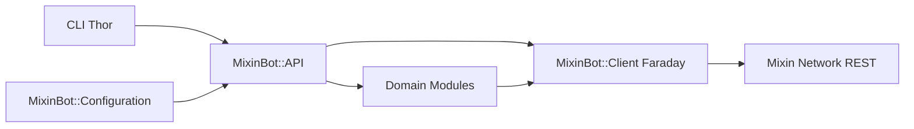
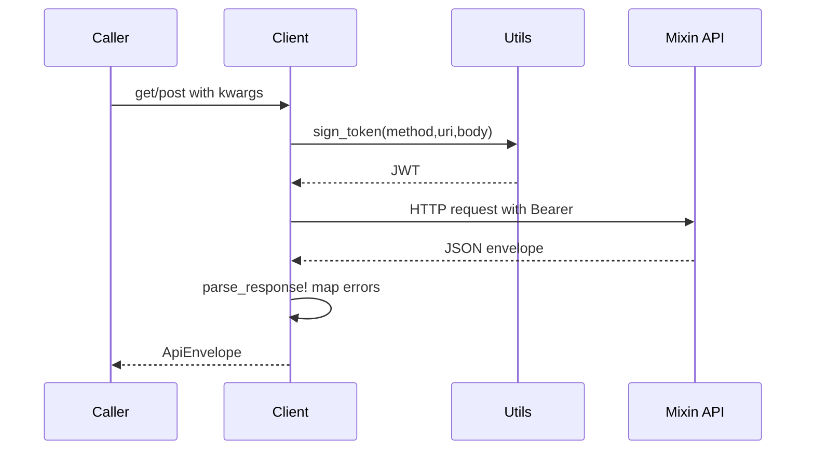
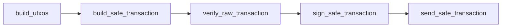

# Home

*[MixinBot](https://github.com/baizhiheizi/mixin_bot) is a Ruby SDK (gem version 2.3.0) and CLI for [Mixin Network](https://developers.mixin.one/docs). It mirrors the official Go and Node SDKs and exposes authenticated REST calls, Safe UTXO transfers, Blaze messaging, network asset catalogs, inscriptions, invoices, transaction encoding, and optional MVM helpers.*

## Project overview

*{ Summarize the gem, its scope (REST SDK + CLI + optional MVM), the SDKs it parallels (bot-api-go-client, bot-api-nodejs-client), and the Ruby/runtime requirements (Ruby >= 3.2, Bundler 2.5+). }*

## Quick links

*[Project README](https://github.com/baizhiheizi/mixin_bot/blob/main/README.md) covers installation and basic usage. [[Getting Started|Getting-Started]] walks through configuration and your first call. [[Architecture|Architecture]] explains how the modules compose. [[API Reference|API-Reference]] documents each domain.*

# Getting Started

## Installation

*{ Document the two install paths: Bundler (`gem 'mixin_bot'`) and direct install (`gem install mixin_bot`). Note that the gem ships the `mixinbot` executable and that the `mixin` CLI is optional. }*

## First call

*{ Walk through configuring credentials with `MixinBot.configure`, calling `MixinBot.api.me`, and reading `MixinBot.api.assets`. Show a minimal Safe transfer via `create_transfer` including the `spend_key` requirement. }*

####+ Prerequisites
*{ Ruby >= 3.2, Bundler 2.5+ recommended, optional `mixin` CLI for the native encoder helpers. }*

####+ Common commands
*{ Enumerate the rake tasks: `rake`, `rake test`, `rake test_live`, `rake mixin_bot:api_coverage`, `rake rdoc`, `rake build`, `rake publish`. }*

# Configuration

## Configuration object

*{ Explain `MixinBot::Configuration` and its attribute list (app_id, client_secret, session_id, session_private_key, server_public_key, spend_key, pin, api_host, blaze_host, debug). Cover key aliasing (`client_id` -> `app_id`, `private_key` -> `session_private_key`, `pin_token` -> `server_public_key`) and automatic Ed25519/Curve25519 format conversions. }*

####+ Keystores
*{ Describe the JSON keystore consumed by the CLI via `-k`/`--keystore` and the `setup_api_instance!` flow that turns it into an `API` instance. }*

####+ Multiple bots
*{ Show creating dedicated `MixinBot::API.new(...)` instances per bot, in contrast to the global singleton via `MixinBot.api`. }*

# Architecture

## Module composition

*{ Explain that `MixinBot::API` (in `lib/mixin_bot/api.rb`) composes ~30 domain modules through Ruby `include`. List the modules: Me, User, Session, Asset, NetworkAsset, Network, Transfer, Transaction, Output, Snapshot, Payment, Multisig, Message, Blaze, Pin, Auth, App, Code, Rpc, ComputerApi, etc. }*



## HTTP client

*{ Document `MixinBot::Client`: Faraday-based, signs JWT access tokens via `MixinBot::Utils.access_token`, retries on `Faraday::ConnectionFailed`/`TimeoutError`, returns `MixinBot::Models::ApiEnvelope`. Mention `get`, `post`, `fetch_get`, `fetch_post`, `fetch_post_array` and the `res['data']` / delegated lookup pattern. }*

## Request lifecycle



# API Reference

*{ Overview of the public API surface: every `MixinBot::API` instance method falls into one of the domain modules. Methods prefixed `safe_*` use the Safe UTXO pipeline; methods prefixed `legacy_*` are deprecated and emit a deprecation warning once. Interactive WebSocket flows (Blaze connect, upload) are not callable from the CLI. }*

####+ Profile & Users
*{ `me`, `safe_me`, `update_me`, `read_user`, `read_users`, `search_user`, `fetch_users`, `friends`. Explain how to retrieve the bot profile and look up counterparties. }*

####+ Assets & Network
*{ `assets`, `asset`, `network_assets`, `network_asset`, `ticker`, `safe_assets`. Distinguish the bot-scoped asset catalog from the public network catalog. }*

####+ Transfers (Safe pipeline)
*{ `create_transfer`, `create_safe_transfer`, `safe_outputs`, `build_safe_transaction`, `verify_raw_transaction`, `sign_safe_transaction`, `send_safe_transaction`, `safe_ghost_keys`. Walk through the UTXO select -> build -> verify -> sign -> submit sequence. }*

####+ Transactions
*{ `transactions`, `transaction`, `safe_transaction`, `verify_transaction`, `safe_register_hashes`. Reference `MixinBot::Transaction` (`version 0x05` SAFE_TX_VERSION) for the underlying envelope. }*

####+ Multisig
*{ `safe_multisig_*` operations and `MixinBot::API::Multisig`: registering member hashes, ghost-key derivation, threshold configuration. }*

####+ Messaging & Blaze
*{ `start_blaze_connect`, `blaze_send_plain_text`, `blaze_send_recall_message`, `send_message`, `send_encrypted_messages`, `conversations`, `create_conversation`. Note the EventMachine/Faye WebSocket lifecycle and `MixinBot::API::Blaze`. }*

####+ Snapshots & Outputs
*{ `snapshots`, `safe_snapshots`, `outputs`, `safe_outputs`, mix-address deposit operations. }*

####+ NFTs & Inscriptions
*{ `create_collectible_request`, `read_collectibles`, `mint`, `inscriptions`, `inscription`. Cross-reference the MVM NFT helpers. }*

####+ Auth & Sessions
*{ `app`, `update_app`, `code`, `session`, `oauth`, `get_access_token`, `util_get_token`. }*

####+ Pin & Tip
*{ `verify_pin`, `create_pin`, `update_pin`, `tip_refresh_token`, `tip_authorize`, `tip_access_token`. }*

####+ Withdrawals & Deposits
*{ `create_withdrawal`, `withdrawal`, `withdrawals`, `safe_withdrawals`, deposit addresses and `MixinBot::Address`/`MixinBot::URLScheme`. }*

####+ Legacy APIs (deprecated)
*{ Briefly enumerate the `legacy_*` modules and explain the deprecation policy: warn once via `MixinBot.deprecator`, slated for removal in 3.0.0. }*

# Safe Pipeline

## Why Safe

*{ Contrast the Safe UTXO API with the legacy transfer API. Explain that Safe offers better security (Ed25519 spend key signing), lower fees, and finer-grained control over inputs/outputs. }*

## Pipeline stages



## Minimal example

*{ Provide a code block showing `create_transfer` (or the explicit `build_utxos` -> `build_safe_transaction` -> ... sequence) with `spend_key`, asset_id, members/threshold, amount, memo, and trace_id. Reference `MixinBot::Utils::Encoder` for low-level encoding. }*

# CLI

## mixinbot command

*{ Document the Thor-based CLI in `lib/mixin_bot/cli.rb`: `mixinbot call METHOD`, `mixinbot list [FILTER]`, `mixinbot schema -o json|yaml`, `mixinbot utils call/list`, plus `mixinbot version`. Note that interactive Blaze connect and upload methods are excluded from `mixinbot call` and require the Ruby API. }*

## Output formats

*{ Explain `--output pretty|json|yaml`, `--pretty`, and the CLI's mapping of internal errors to structured `kind` (`auth`, `api_error`, `not_found`). }*

# Transactions

## Transaction envelope

*{ Document `MixinBot::Transaction` (SAFE_TX_VERSION = 0x05), `MixinBot::Transaction::Encoder`, and `MixinBot::Transaction::Decoder`. Cover the magic prefix, MAX_EXTRA_SIZE = 512, aggregated signature masks, and references-version support (0x04). }*

## Encoder & Decoder

*{ Reference `MixinBot::Utils::Encoder`/`Utils::Decoder` for low-level int/binary packing and the wrapper methods `encode_raw_transaction` / `decode_raw_transaction` (Ruby + native `mixin` CLI fallback). }*

# Utils & Crypto

*{ Explain `MixinBot::Utils` as a composition of four sub-modules: Address, Crypto, Decoder, Encoder. Show access via `MixinBot.utils` or `api.utils`. }*

####+ Crypto helpers
*{ `access_token` (JWT signing), `generate_ed25519_key`, `encrypt_pin`, `decode_key`, `unique_uuid`. }*

####+ Address helpers
*{ Main address, ghost-key derivation, address validation - tied to `MixinBot::Address` and `lib/mixin_bot/utils/address.rb`. }*

# MVM

## Overview

*{ Document the optional `MVM` (Mixin Virtual Machine) helpers under `lib/mvm/`: `MVM::Bridge`, `MVM::Client`, `MVM::Nft`, `MVM::Registry`, `MVM::Scan`. Cover `MVM.bridge`, `MVM.nft`, `MVM.scan`, `MVM.registry` singletons and the constants `RPC_URL`, `MIRROR_ADDRESS`, `REGISTRY_ADDRESS`. }*

## ERC-20/721/1155

*{ Explain that MVM exposes the standard contract ABIs (`lib/mvm/abis/erc20.json`, `erc721.json`, `bridge.json`, `mirror.json`, `registry.json`) for cross-chain and NFT operations. }*

# Errors & Error Handling

## Error hierarchy

*{ Outline the base `MixinBot::Error` / `MixinBot::APIError` hierarchy in `lib/mixin_bot/errors.rb`. Map specific subclasses to HTTP/API conditions: `ResponseError`, `UnauthorizedError`, `ForbiddenError`, `RateLimitError`, `ValidationError`, `ConflictError`, `TransferError`, `TransientError`, `ServerError`, `InsufficientBalanceError`, `UtxoInsufficientError`, `InsufficientPoolError`, `PinError`, `NotFoundError`, `UserNotFoundError`, `AppUpdateRequiredError`, `InvalidAddressFormatError`. }*

####+ Retries & throttling
*{ Explain `client_error?`, `retryable?`, `throttle?` predicates and the canonical `MixinBot.retryable?` helper used by callers and the Faraday retry middleware. }*

####+ Local validation errors
*{ Distinguish API errors from local argument errors: `MixinBot::ArgumentError`, `ConfigurationNotValidError`, `InvalidUuidFormatError`, `InvalidInvoiceFormatError`, `InvalidNfoFormatError`, `InvalidTransactionFormatError`. }*

# Models

*{ Describe `lib/mixin_bot/models/` (asset, user, output, api_envelope, address, safe_multisig_request, ghost_keys, sequencer_transaction_request) and how the HTTP client wraps responses in `MixinBot::Models::ApiEnvelope`. }*

# Development

## Running tests

*{ Document the offline test suite (`rake test`) backed by WebMock stubs and the live mode (`LIVE=1 rake test_live`) requiring `test/config.yml`. Mention the fixtures under `test/fixtures/`. }*

## Linting & coverage

*{ Cover RuboCop (`rake rubocop`) and the parity task `rake mixin_bot:api_coverage` that checks the Ruby SDK against the official Go SDK endpoint catalog. }*

####+ OpenSpec workflow
*{ Describe the OpenSpec-driven change workflow: `opsx propose`, `opsx apply`, `opsx archive`, `opsx explore`. Point to the specs under `openspec/specs/` (api-coverage-gate, api-error-code-catalog, ci-pipeline, dependency-updates, release-publish, create-user-billing-gate). }*

####+ Docs & RDoc
*{ Document `rake rdoc` (output in `doc/`), `docs/agent/cli.md` and `docs/agent/cookbook.md`, and the maintenance workflows under `.github/workflows/`. }*

# For Agents

These pages provide compact documentation indexes for AI coding agents.

## AGENTS.md

You can add this to your repository root as `AGENTS.md` to give AI coding agents quick access to project documentation.

```
# MixinBot
> Ruby SDK (gem 2.3.0) and CLI for Mixin Network: Safe UTXO transfers, Blaze messaging, MVM helpers.
Wiki: https://github.com/baizhiheizi/mixin_bot/wiki
To read any page: https://github.com/baizhiheizi/mixin_bot/wiki/{slug}
Section: https://github.com/baizhiheizi/mixin_bot/wiki/{slug}#{anchor}

## Page Index
|Home: Project overview and quick links
|Getting-Started: Install, configure, first call
|  Getting-Started#Prerequisites: Ruby/Bundler/mixin CLI requirements
|  Getting-Started#Common-commands: rake tasks
|Configuration: Configuration object, key conversion, keystores
|  Configuration#Keystores: JSON keystore flow
|  Configuration#Multiple-bots: per-instance API
|Architecture: Module composition, HTTP client, request lifecycle
|API-Reference: Public API surface by domain
|  API-Reference#Profile-&-Users: me, safe_me, read_user, friends
|  API-Reference#Assets-&-Network: assets, network_assets, ticker
|  API-Reference#Transfers-(Safe-pipeline): create_transfer, build_safe_transaction, ...
|  API-Reference#Transactions: safe_transaction, verify_transaction
|  API-Reference#Multisig: safe_multisig_*, member hashes
|  API-Reference#Messaging-&-Blaze: start_blaze_connect, send_message
|  API-Reference#Snapshots-&-Outputs: snapshots, outputs, deposits
|  API-Reference#NFTs-&-Inscriptions: collectibles, inscriptions
|  API-Reference#Auth-&-Sessions: app, session, oauth
|  API-Reference#Pin-&-Tip: verify_pin, tip_*
|  API-Reference#Withdrawals-&-Deposits: create_withdrawal, deposits
|  API-Reference#Legacy-APIs-(deprecated): legacy_* deprecations
|Safe-Pipeline: Safe UTXO pipeline stages and example
|CLI: mixinbot call/list/schema and output formats
|Transactions: Transaction envelope and encoder/decoder
|Utils-&-Crypto: Address, Crypto, Decoder, Encoder
|  Utils-&-Crypto#Crypto-helpers: access_token, generate_ed25519_key, encrypt_pin
|  Utils-&-Crypto#Address-helpers: main address, ghost keys
|MVM: Bridge, Nft, Registry, Scan (Mixin Virtual Machine)
|Errors-&-Error-Handling: APIError hierarchy, retry/throttle
|  Errors-&-Error-Handling#Retries-&-throttling: retryable? / throttle?
|  Errors-&-Error-Handling#Local-validation-errors: ArgumentError, ConfigurationNotValidError
|Models: ApiEnvelope and domain models
|Development: Tests, RuboCop, coverage, OpenSpec, RDoc
|  Development#OpenSpec-workflow: opsx propose/apply/archive/explore
|  Development#Docs-&-RDoc: rake rdoc and docs/agent/
```

## llms.txt

You can serve this at `yoursite.com/llms.txt` or include it in your repository to help LLMs discover your documentation.

```
# MixinBot
> Ruby SDK and CLI for Mixin Network (gem 2.3.0) with Safe UTXO transfers, Blaze messaging, and MVM helpers.

## Wiki Pages
- [Home](https://github.com/baizhiheizi/mixin_bot/wiki/Home): Project overview and quick links
- [Getting Started](https://github.com/baizhiheizi/mixin_bot/wiki/Getting-Started): Install, configure, first call
- [Configuration](https://github.com/baizhiheizi/mixin_bot/wiki/Configuration): Configuration object, key conversion, keystores
- [Architecture](https://github.com/baizhiheizi/mixin_bot/wiki/Architecture): Module composition, HTTP client, request lifecycle
- [API Reference](https://github.com/baizhiheizi/mixin_bot/wiki/API-Reference): Public API surface by domain
- [Safe Pipeline](https://github.com/baizhiheizi/mixin_bot/wiki/Safe-Pipeline): UTXO select -> build -> sign -> submit
- [CLI](https://github.com/baizhiheizi/mixin_bot/wiki/CLI): mixinbot call/list/schema
- [Transactions](https://github.com/baizhiheizi/mixin_bot/wiki/Transactions): Transaction envelope and encoding
- [Utils & Crypto](https://github.com/baizhiheizi/mixin_bot/wiki/Utils-Crypto): Address, Crypto, Decoder, Encoder helpers
- [MVM](https://github.com/baizhiheizi/mixin_bot/wiki/MVM): Mixin Virtual Machine helpers
- [Errors & Error Handling](https://github.com/baizhiheizi/mixin_bot/wiki/Errors-Error-Handling): APIError hierarchy and retry semantics
- [Models](https://github.com/baizhiheizi/mixin_bot/wiki/Models): ApiEnvelope and domain models
- [Development](https://github.com/baizhiheizi/mixin_bot/wiki/Development): Tests, RuboCop, coverage, OpenSpec workflow
```